# Game Maker

> A game-editor in browser powered by Vue.js & Babylon.js

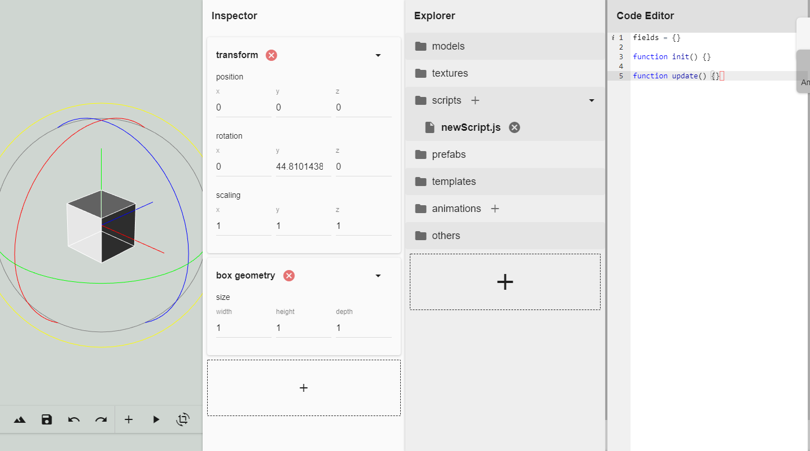

## Build Setup

``` bash
# install dependencies
npm install

# serve with hot reload at localhost:9080
npm run dev

# build for production with minification
npm run build

# build for production and view the bundle analyzer report
npm run build --report
```

For detailed explanation on how things work, checkout the [guide](http://vuejs-templates.github.io/webpack/) and [docs for vue-loader](http://vuejs.github.io/vue-loader).

## Features
Game Maker is a designed to be a lightweight, single-scene html5 game editor runs in your browser,
the idea of its functionality came from the well-known Unity3D game engine, so they have many features
in common, like script system or animation editor, but come with a much simpler form in Game Maker.

#### Desktop/Window Manager
To manage the display of multiple components in your screen.


#### Canvas
Component to render the 3D scene. A default universal Camera is used for user to
explore the scene and a edit tool is used to edit GameObjects' transform.

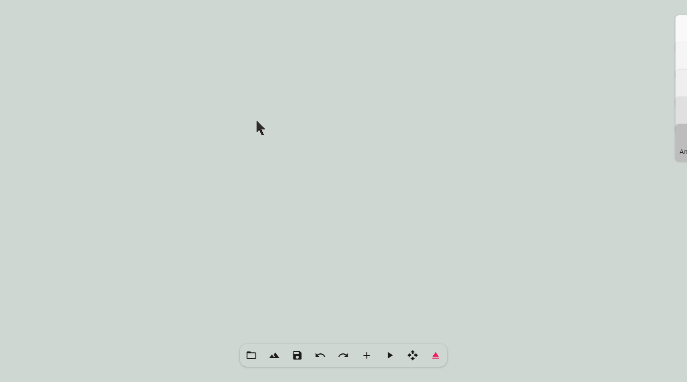
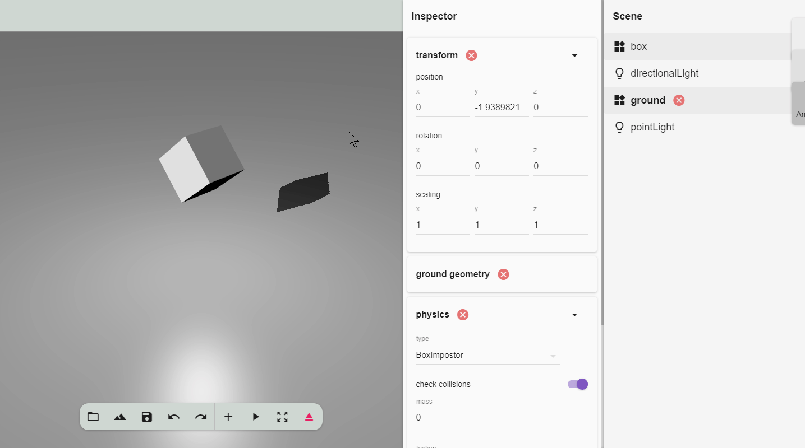

#### Inspector
Component to view/edit gameObjects' properties (actually scripts' public variables).

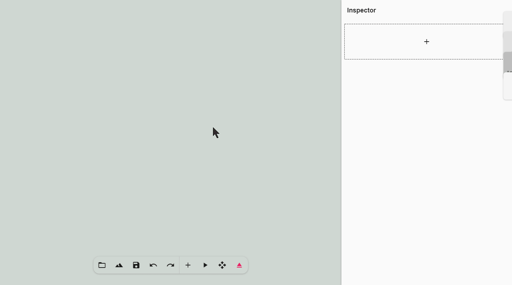

#### Script System
The Script System transform JavaScript files to dynamic user interface,
to visually edit scripts' internal variables.


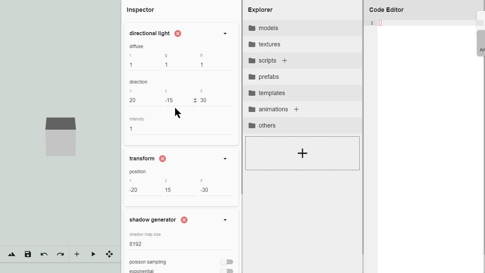

You can define some public variables which will be exposed to the outer scope,
the editor will transform the public variables into visual user interfaces according their
type, so that you can edit them visually in Inspector.
###### Visualizable component types
| Variable type | Visualized component |
| ------------- | -------------------- |
| NUMBER        | number text field    |
| STRING        | string text field    |
| BOOLEAN       | switch               |
| GAMEOBJECT    | gameObject drop area |
| FILE          | file drop area       |
| ENUM          | multi select picker  |
| GROUP         | components group     |
| ARRAY         | dynamic components array |

You can also define some handler functions
to react to the games' events.
###### Events supported by Script System
| Event functions | Triggers          |
| --------------- | ----------------- |
| `init`            | game initialization |
| `update`          | before each frame rendering |
| `lateUpdate`      | after each frame rendering |
| `onFocus`         | when user select a gameObject |
| `onBlur`          | when user deselect a gameObject |
| `pointerdown`     | when user clicks the mouse |
| `keydown`         | when user presses down a key |
| `keyup`           | when user presses up a key |

###### Default scripts
| Type | Scripts |
| ---- | ------- |
| Basic | `animation.js`, `physics.js`, `transform.js​` |
| Cameras | `arcRotateCamera.js`, `followCamera.js`, `universalCamera.js` |
| Geometries | `boxGeometry.js`, `groundGeometry.js`, `geometry.js`, `planeGeometry.js`, `sphereGeometry.js` |
| Lights | `directionalLight.js`, `hemisphericLight.js`, `pointLight.js`, `shadowGenerator.js`, `spotlight.js` |
| Materials | `backgroundMaterial.js`, `standardMaterial.js`, `pbrMaterial.js` |

#### Scene
Component to manage all the GameObjects in the scene, where you edit the basic
properties of GameObjects such as name and parent-child relation.


#### Shortcuts
The editor also has some shortcuts to make your life easier.

| Shortcut | Function |
| -------- | -------- |
| `Ctrl+Alt+F` | Focus your chosen GameObject |
| `Ctrl+Alt+D` | Duplicate your chosen GameObject |
| `Ctrl+Z` | Undo |
| `Ctrl+Shift+Z` | Redo |

#### Explorer
Component to manage all the resources of the project.

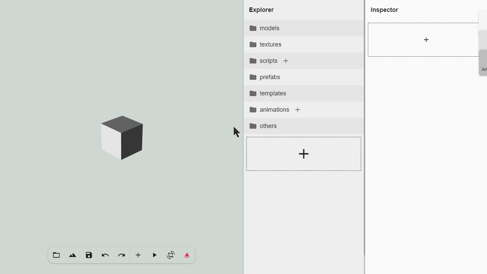

#### Two special file type
- Template(`.temp`): the template of scripts
- Prefab(`.pref`): the template of GameObjects

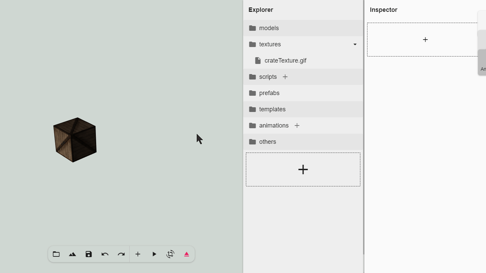
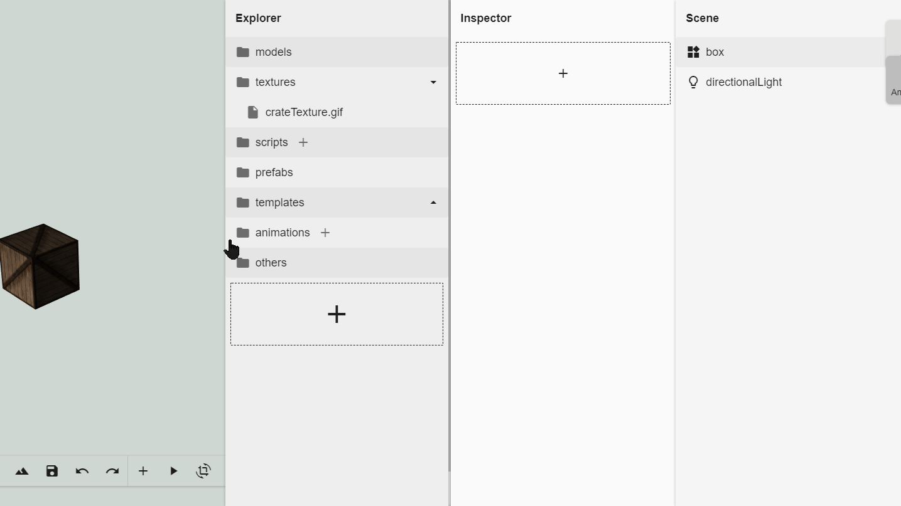

#### Code Editor
Component to edit JavaScript or other text files in the editor.
Vim mode on by default.

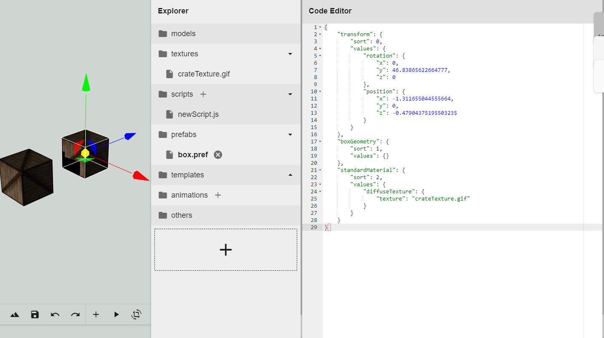

#### Animation Editor
Component to make the scene animated. Animations are stored in a separate file
so that they can be reused by different GameObjects.

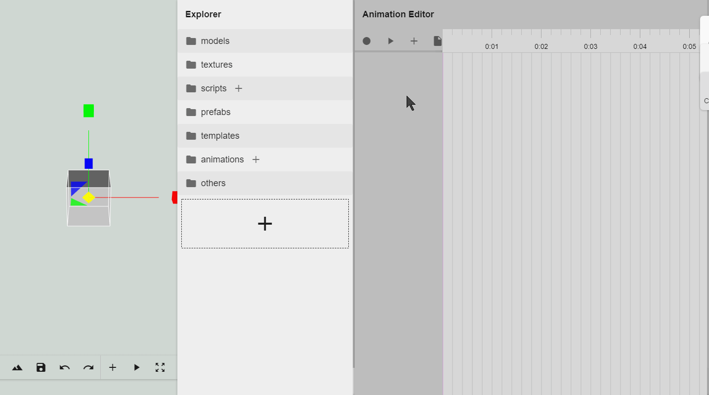

## Demo

#### MiniGame

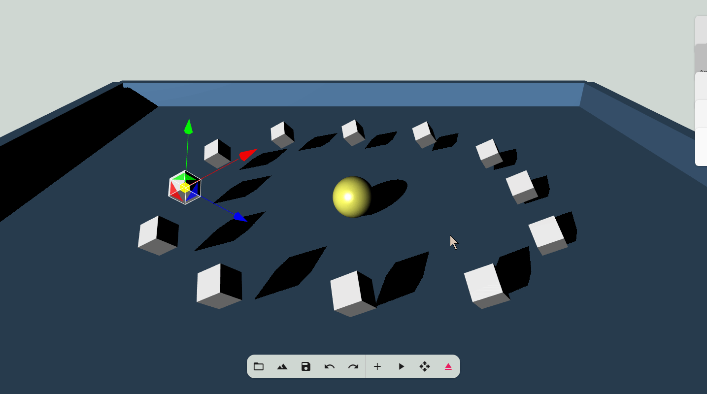

#### Space Shooter


